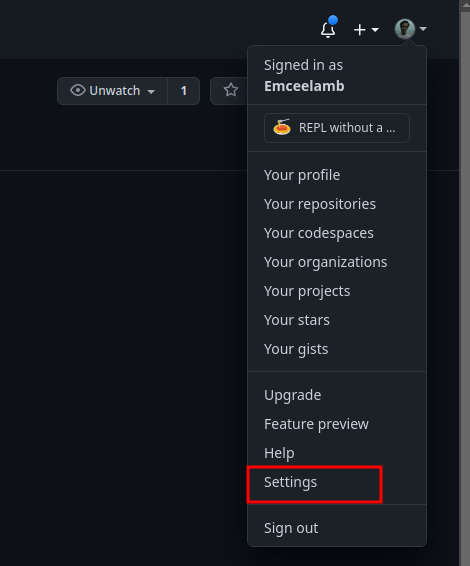
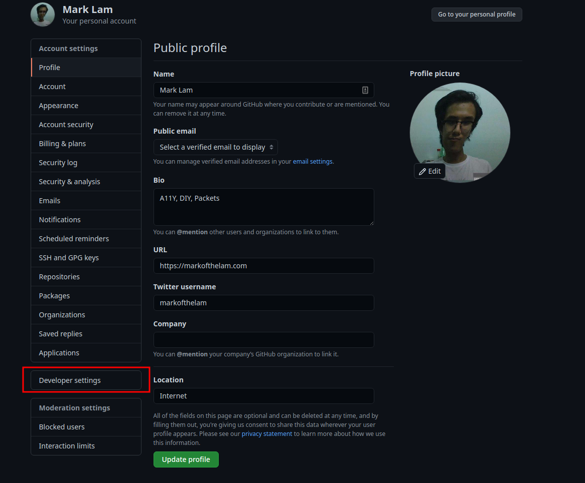
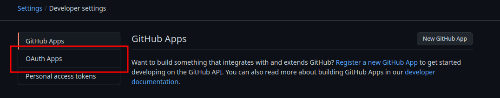
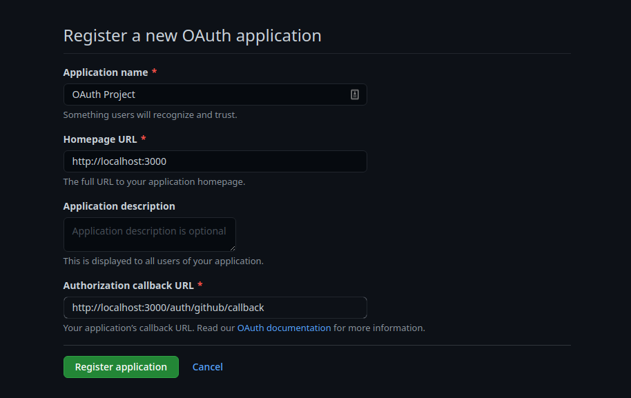
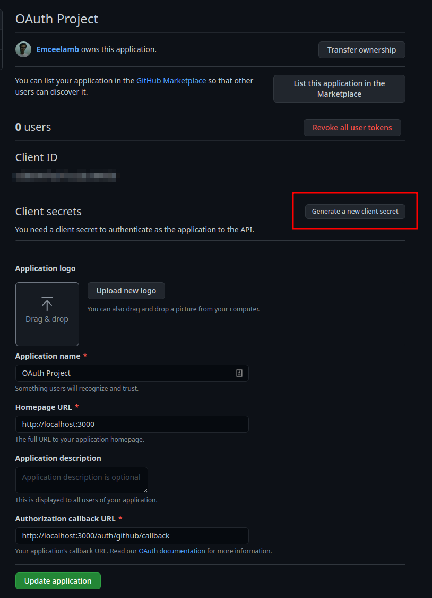

# OAuth Project

Starting and Solution code for CC OAuth project.

Requires a GitHub account.

## Off-Platform Steps to create an OAuth Application

1. Go to GitHub Settings page

2. Select Developer Settings

3. Select OAuth Apps

4. Create New OAuth App with:
  - Application Name: `OAuth Project`
  - Homepage URL: `localhost:3000`
  - Authorization `callback URL: http:localhost:3000/auth/callback`

5. Generate new client secret

